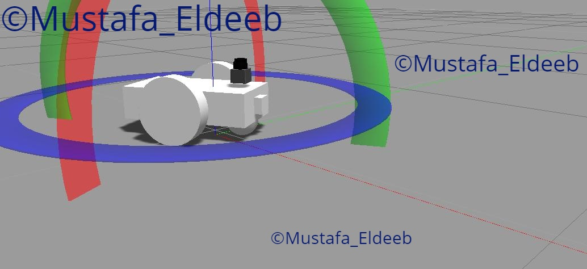

# RoboND Robot Localization Project (Where I Am)
## using AMCL ROS Package
## (c) Mustafa Eldeeb
## march 2020


## Creating a new ROS package from scratch
If you would like to create the simulated robot package from scratch please see steps on th following file:
[udacity_bot package creation steps](udacity_bot_creation_steps.md)

## Repository installation steps:

* Clone from git repository
```bash
$ cd ~
$ git clone https://github.com/mkhuthir/RoboND_Robot_Localization_Project.git catkin_ws
```

* Install the following packages if it is not yet installed:

```bash
$ sudo apt-get install ros-kinetic-navigation
$ sudo apt-get install ros-kinetic-map-server
$ sudo apt-get install ros-kinetic-move-base
$ rospack profile
$ sudo apt-get install ros-kinetic-amcl
```

* Compile code using `catkin_make` and source it.

```bash
$ cd catkin_ws
$ catkin_make
$ source ~/catkin_ws/devel/setup.bash
```

## Launching udacity_bot Packages

* if you want to launch empty world with only the robot use the following:

```bash
$ roslaunch udacity_bot udacity_empty_world.launch
```
* to launch the simulated robot along with amcl package in jackal race world, run the following commands each in a separate terminal window.

To launch jackal race world

```bash
$ roslaunch udacity_bot udacity_world.launch
```
To start amcl node

```bash
$ roslaunch udacity_bot amcl.launch
```
To send 2d navigation goal

```bash
$ rosrun udacity_bot navigation_goal
```
## udacity_bot creation steps

### Robot chassis with casters:

<p align="center">  </p>

### Robot chassis with wheels:

<p align="center">  </p>

### Robot chassis + wheels + camera sensor:

<p align="center">  </p>

### Robot chassis + wheels + camera sensor + laser finder sensor:

<p align="center">  </p>

### Full robot model with material colors in RViz:

<p align="center">  </p>

### Robot after reaching goal in jackal race world.

<p align="center">  </p>


## Launching deeb_bot Packages

* if you want to launch empty world with only the robot use the following:

```bash
$ roslaunch deeb_bot deeb_empty_world.launch
```
* to launch the simulated robot along with amcl package in jackal race world, run the following commands each in a separate terminal window.

To launch jackal race world

```bash
$ roslaunch deeb_bot deeb_world.launch
```
To start amcl node

```bash
$ roslaunch deeb_bot amcl.launch
```
To send 2d navigation goal

```bash
$ rosrun deeb_bot navigation_goal_d
```

## deeb_bot 

To create this bot package from scatch you can follow same steps as explained above with some differences in gazebo plugins and config files.

### Robot in gazebo:


Remove caster wheels then add another two wheels.so it become with 4 wheels.
modify the lidar position.Resize the main chasis.

For steering control I have used this gazebo plugin :
```
<gazebo>
    <plugin name="skid_steer_drive_controller" filename="libgazebo_ros_skid_steer_drive.so">
      <alwaysOn>true</alwaysOn>
      <updateRate>100.0</updateRate>
      <leftFrontJoint>front_left_wheel_joint</leftFrontJoint>
      <rightFrontJoint>front_right_wheel_joint</rightFrontJoint>
      <leftRearJoint>back_left_wheel_joint</leftRearJoint>
      <rightRearJoint>back_right_wheel_joint</rightRearJoint>
      <wheelSeparation>0.4</wheelSeparation>
      <wheelDiameter>0.120</wheelDiameter>
      <wheelAcceleration>0</wheelAcceleration>
      <wheelTorque>5</wheelTorque>
      <torque>10</torque>
      <commandTopic>cmd_vel</commandTopic>
      <odometryTopic>odom</odometryTopic>
      <odometryFrame>odom</odometryFrame>
      <rosDebugLevel>na</rosDebugLevel>
      <odometrySource>world</odometrySource>
      <robotBaseFrame>robot_footprint</robotBaseFrame>
      <legacyMode>false</legacyMode>
      <publishWheelTF>false</publishWheelTF>
      <publishWheelJointState>false</publishWheelJointState>
      <publishTf>1</publishTf>
      <covariance_x>0.0001</covariance_x>
      <covariance_y>0.0001</covariance_y>
      <covariance_yaw>0.01</covariance_yaw>
      <topicName>cmd_vel</topicName>
      <broadcastTF>true</broadcastTF>
    </plugin>
  </gazebo>


```
In amcl.yaml file :

```
odom_model_type:  diff -corrected 

```


<p align="center">  </p>


### Full robot model with material colors in RViz:

<p align="center">  </p>

### Robot on its way to goal in jackal race world.

<p align="center">  </p>

### Robot after reaching goal in jackal race world.

<p align="center">  </p>


